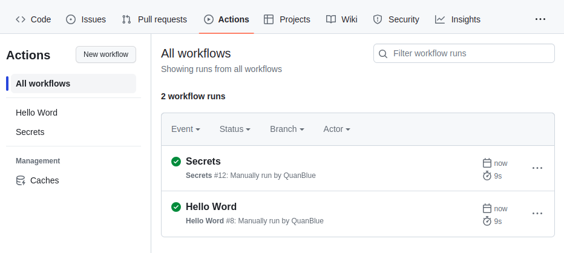
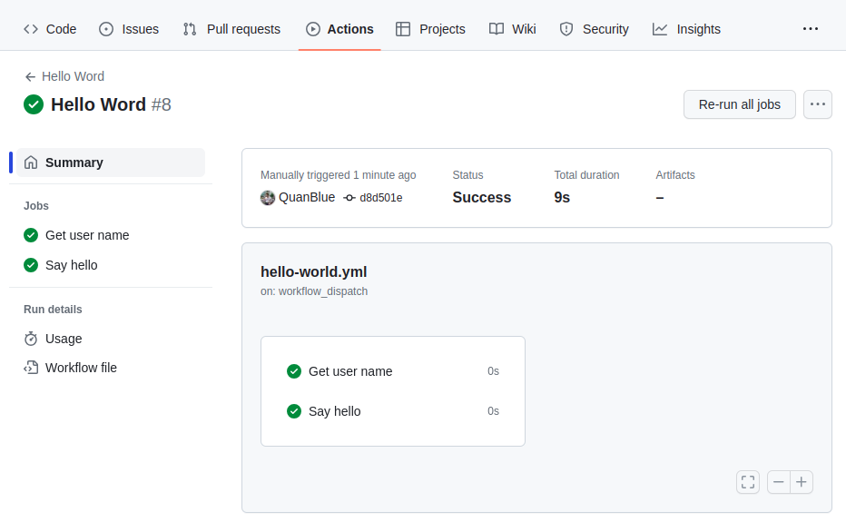
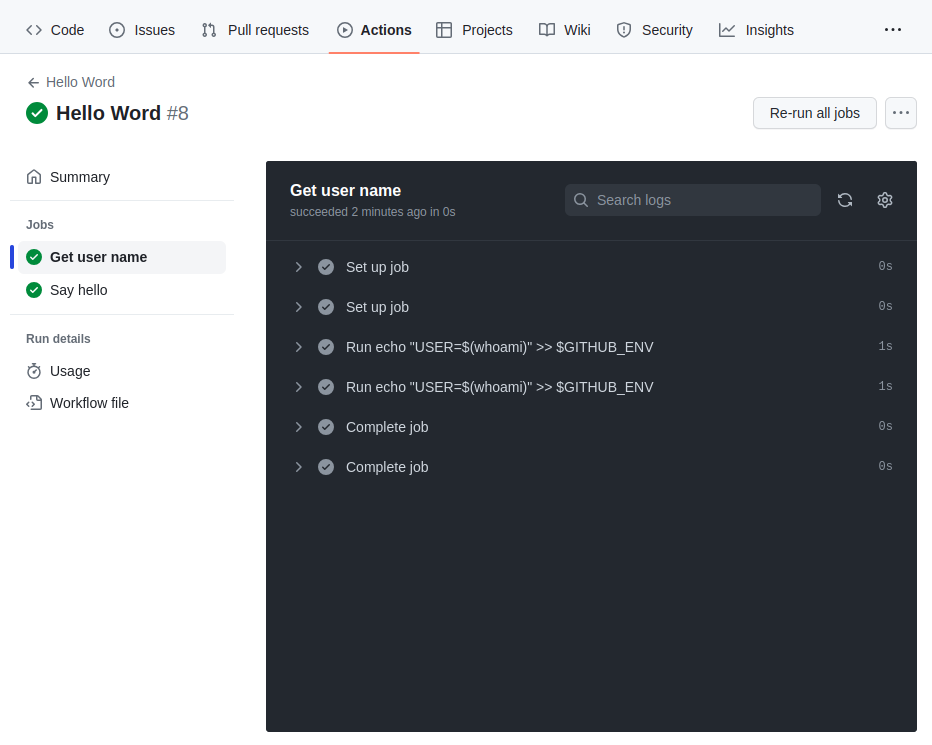
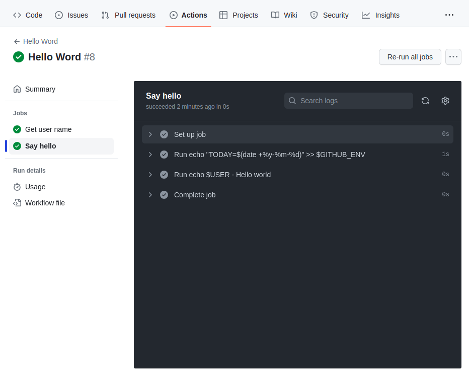
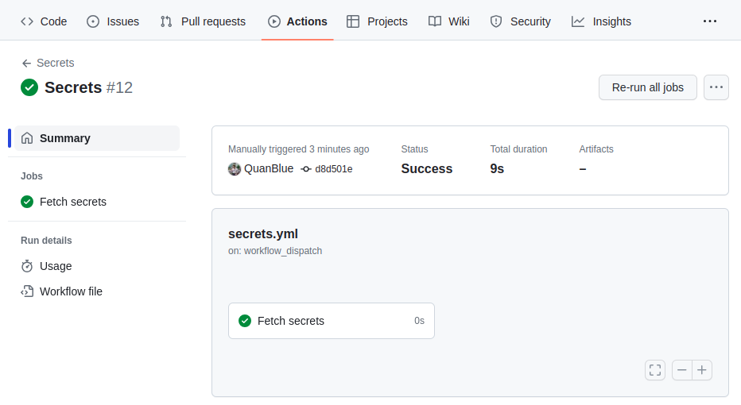
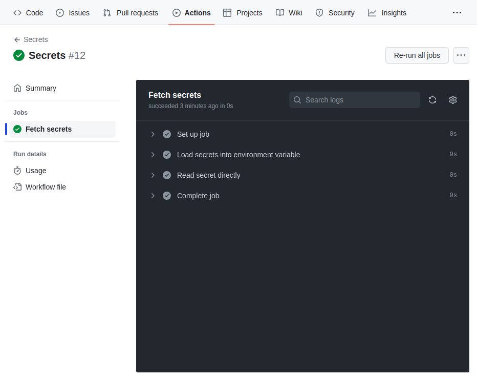
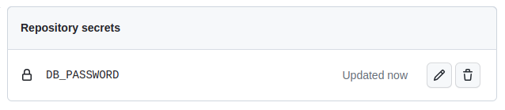

# Workflow files Example

After `Push`, `Pull Request`, or `Workflow Dispatch` event trigger workflow, we can see the workflow in `Actions` tab.

<i>Figure 1: Action board</i>

We can see, 2 workflows are `triggered`. and `complete`. Let's inspect the `Hello World` workflow.

<i>Figure 2: Hello world workflow</i>

There are 2 jobs in this Workflow: `Get user name` and `Say hello`. Let's inspect the `Get user name` job.

<i>Figure 3: Hello world workflow - Get user name job</i>

All Task is `completed`, and we can see the `output` of each task.

Let's inspect the `Get user name` job.

<i>Figure 4: Hello world workflow - Say hello job</i>

All Task is `completed`, and we can see the `output` of each task.

Turn out to `Secret` workflow, we can see the `Secret` workflow is `triggered` and `complete` too.

<i>Figure 5: Secret workflow</i>

There are a job in this Workflow: `Fetch secrets`. Let's inspect the `Fetch secrets` job.

All Task is `completed`, and we can see the `output` of each task.

In 2 task `Load secrets into environment variables` and `Read secret directly`, we can see the `Secrets` value is `masked` by `***`. This is Github's security feature to prevent `Secrets` value leak to `log`.

To set the `Secrets` value, we can go to `Settings > Secrets and variables > Actions` tab. Figure bellow show the secret key I have set.

<i>Figure 6: Repo secret</i>

