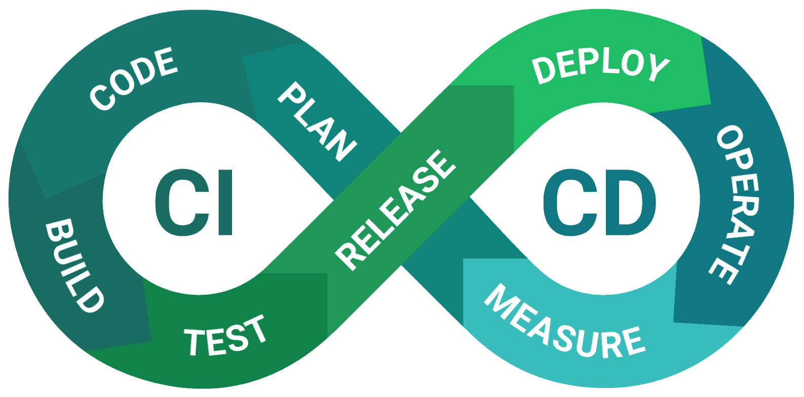

<h1 align="center">
  </img>
   
  <b>
    Continuous Integration/  
    Continuous Deployment
  </b>
</h1>

This category includes cheat sheets related to various aspects of CI/CD.

<!-- Badges -->

  
  
  
  
  
  

  <b>
      <a href="https://github.com/QuanBlue/Tech-Cheatsheets">Home Page</a> •
      <a href="https://github.com/QuanBlue/Tech-Cheatsheets/issues/">Report Bug</a> •
      <a href="https://github.com/QuanBlue/Tech-Cheatsheets/issues/">Request Feature</a>
  </b>

 

<b>Table of Contents</b>

-  [Introduction](#star-introduction)
-  [Contents](#open_book-contents)
-  [Usage Instructions](#rainbow-usage-instructions)

# :star: Introduction

CI/CD (Continuous Integration/Continuous Deployment) is a software development practice that enables developers to automate the process of integrating code changes, running tests, and deploying applications. By adopting CI/CD, teams can ensure faster and more reliable software delivery, reducing the risk of errors and improving overall efficiency.

This category includes cheat sheets related to various aspects of CI/CD, such as setting up pipelines, configuring build and deployment tools, and best practices for implementing CI/CD workflows. The cheat sheets provide quick references and helpful tips to streamline your CI/CD processes and optimize your software delivery pipeline.

# :open_book: Contents

-  [GitHub Actions](https://github.com/QuanBlue/Tech-Cheatsheets/tree/main/CI.CD/Github-Actions) - workflow automation tool for GitHub repositories.

# :rainbow: Usage Instructions

-  Review the cheat sheets to gain a better understanding of CI/CD concepts and practices.
-  Follow the step-by-step instructions provided in the cheat sheets to set up your CI/CD pipelines.
-  Use the cheat sheets as quick references to configure specific CI/CD tools and platforms.
-  Troubleshoot common issues by referring to the troubleshooting tips and solutions in the cheat sheets.

---

> Bento [@quanblue](https://bento.me/quanblue) &nbsp;&middot;&nbsp;
> GitHub [@QuanBlue](https://github.com/QuanBlue) &nbsp;&middot;&nbsp; Gmail quannguyenthanh558@gmail.com
