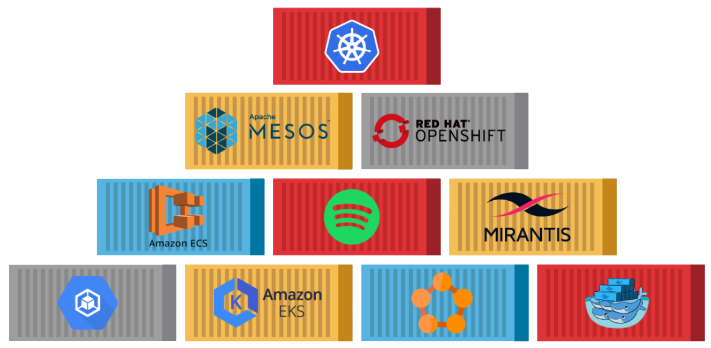

<h1 align="center">
  </img>
   
  <b>Container Orchestration</b>
</h1>

 This category contains cheat sheets related to popular container orchestration platforms and tools, helping you understand and utilize container orchestration effectively.

<!-- Badges -->

  
  
  
  
  
  

  <b>
      <a href="https://github.com/QuanBlue/Tech-Cheatsheets">Home Page</a> •
      <a href="https://github.com/QuanBlue/Tech-Cheatsheets/issues/">Report Bug</a> •
      <a href="https://github.com/QuanBlue/Tech-Cheatsheets/issues/">Request Feature</a>
  </b>

 

<b>Table of Contents</b>

-  [Introduction](#star-introduction)
-  [Contents](#open_book-contents)
-  [Usage Instructions](#rainbow-usage-instructions)

# :star: Introduction

Container orchestration tools are essential for managing and scaling containerized applications in distributed environments. These tools provide automation, coordination, and scheduling capabilities to efficiently deploy, scale, and manage containers across a cluster of machines. They help streamline container deployment, monitoring, service discovery, load balancing, and fault tolerance, making it easier to manage complex containerized applications.

Container orchestration tools offer features like:

-  **Service Discovery:** They enable automatic discovery of containers, allowing services to find and communicate with each other.

-  **Load Balancing:** They distribute incoming network traffic across multiple containers to ensure optimal resource utilization and high availability.

-  **Scaling:** They allow you to scale containers up or down based on demand, ensuring that your application can handle increased traffic or workload.

-  **Health Monitoring:** They provide health checks and monitoring capabilities to detect and respond to container failures or performance issues.

-  **Auto-Scaling:** Some orchestration tools can automatically adjust the number of containers based on predefined metrics, optimizing resource allocation.

-  **Rolling Updates:** They facilitate seamless deployment of updates by gradually replacing old containers with new ones, minimizing downtime.

-  **Service Registry:** They maintain a centralized registry of available services, making it easier to manage and discover services across the cluster.

# :open_book: Contents

-  [Docker Swarm](https://github.com/QuanBlue/Tech-Cheatsheets/tree/main/Container%20Orchestration/Docker%20Swarm) - A native clustering and orchestration solution provided by Docker.

# :rainbow: Usage Instructions

-  Familiarize yourself with the cheat sheets to gain a comprehensive understanding of container orchestration concepts and terminology.
-  Use the cheat sheets as a reference for deploying, scaling, and managing containerized applications on various orchestration platforms.
-  Learn about different strategies and best practices for service discovery, load balancing, and container networking in the context of orchestration.
-  Explore the cheat sheets to configure monitoring and logging solutions for your containerized environments.

---

> Bento [@quanblue](https://bento.me/quanblue) &nbsp;&middot;&nbsp;
> GitHub [@QuanBlue](https://github.com/QuanBlue) &nbsp;&middot;&nbsp; Gmail quannguyenthanh558@gmail.com
