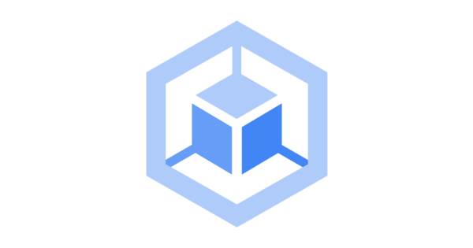

<h1 align="center">
  </img>
   
  <b>Containerization</b>
</h1>

 This category includes cheat sheets related to containerization technologies and tools, providing guidance on containerizing applications, managing containerized environments, and leveraging container orchestration platforms.

<!-- Badges -->

  
  
  
  
  
  

  <b>
      <a href="https://github.com/quanblue/tech-cheatsheets">Home Page</a> •
      <a href="https://github.com/quanblue/tech-cheatsheets/issues/">Report Bug</a> •
      <a href="https://github.com/quanblue/tech-cheatsheets/issues/">Request Feature</a>
  </b>

 

<b>Table of Contents</b>

-  [Introduction](#star-introduction)
-  [Contents](#open_book-contents)
-  [Usage Instructions](#rainbow-usage-instructions)

# :star: Introduction

Containerization tools are software platforms or frameworks that enable the creation, deployment, and management of containers. Containers provide a lightweight and isolated environment for running applications, allowing them to be easily packaged with their dependencies and run consistently across different computing environments.

# :open_book: Contents

-  [Docker](https://github.com/quanblue/tech-cheatsheets/tree/master/Containerization/Docker) - Lightweight containerization platform.
-  [Docker compose](https://github.com/quanblue/tech-cheatsheets/tree/master/Containerization/Docker%20Compose) - Simplifies multi-container application deployment.

# :rainbow: Usage Instructions

-  Use the cheat sheets to learn the basics of Docker and containerization concepts.
-  Follow the step-by-step instructions to containerize your applications using Docker.
-  Explore different Dockerfile directives and their usage to create efficient container images.
-  Learn about container networking and how to connect containers and expose ports.
-  Refer to the cheat sheets for best practices and security considerations when working with containers.

---

> Bento [@quanblue](https://bento.me/quanblue) &nbsp;&middot;&nbsp;
> GitHub [@QuanBlue](https://github.com/QuanBlue) &nbsp;&middot;&nbsp; Gmail quannguyenthanh558@gmail.com
