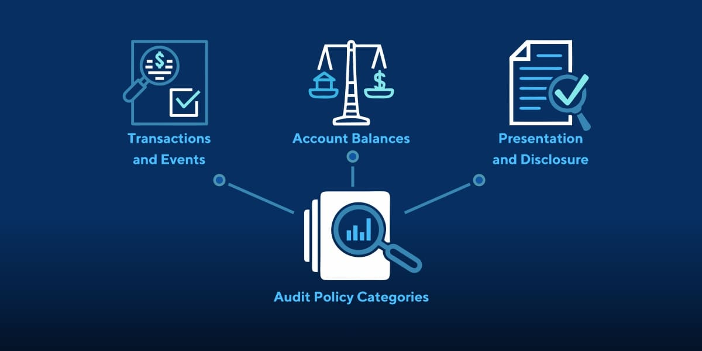

<h1 align="center">
  </img>
   
   Monitoring and Logging  Management</b>
</h1>

 This category contains cheat sheets related to Infrastructure as Code.

<!-- Badges -->

  
  
  
  
  
  

  <b>
      <a href="https://github.com/quanblue/tech-cheatsheets">Home Page</a> •
      <a href="https://github.com/quanblue/tech-cheatsheets/issues/">Report Bug</a> •
      <a href="https://github.com/quanblue/tech-cheatsheets/issues/">Request Feature</a>
  </b>

 

<b>Table of Contents</b>

- [:star: Introduction](#star-introduction)
- [:open\_book: Contents](#open_book-contents)

# :star: Introduction

**Monitoring and logging** are essential components in software development and system administration. They help track and analyze various aspects of an application or system, providing valuable insights for troubleshooting, performance optimization, and overall system health.

- **Monitoring** involves actively *observing the system's behavior*, *collecting data on key metrics* such as CPU usage, memory utilization, network traffic, and response times. 
   > This real-time monitoring allows you to detect anomalies, identify performance bottlenecks, and respond promptly to issues.

- **Logging** involves *capturing and storing important events, errors, and activities* that occur within an application or system. Logs serve as a historical record of events and can be invaluable for debugging, auditing, and compliance purposes.
  > They often include information such as timestamps, severity levels, error messages, and relevant contextual data.

# :open_book: Contents

-  [Grafana](https://github.com/quanblue/tech-cheatsheets/tree/master/Monitoring%20and%20Logging/Grafana) - Data visualization and monitoring platform used to create interactive dashboards.
-  [Prometheus](https://github.com/quanblue/tech-cheatsheets/tree/master/Monitoring%20and%20Logging/Prometheus) - Monitoring and alerting toolkit for collecting and analyzing metrics from diverse systems.

---

> Bento [@quanblue](https://bento.me/quanblue) &nbsp;&middot;&nbsp;
> GitHub [@QuanBlue](https://github.com/QuanBlue) &nbsp;&middot;&nbsp; Gmail quannguyenthanh558@gmail.com
