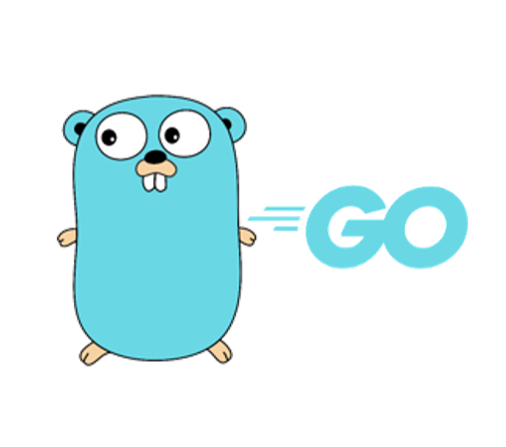

<h1 align="center">
  </img>
  <br>
  <b>Golang cheatsheet</b>
</h1>

<p align="center"> Quick reference for common commands and syntax in Golang for efficient script development.</p>

<!-- Badges -->
<p align="center">
  <a href="https://github.com/quanblue/tech-cheatsheets/graphs/contributors">
    
  </a>
  <a href="">
    
  </a>
  <a href="https://github.com/quanblue/tech-cheatsheets/network/members">
    
  </a>
  <a href="https://github.com/quanblue/tech-cheatsheets/stargazers">
    
  </a>
  <a href="https://github.com/quanblue/tech-cheatsheets/issues/">
    
  </a>
  <a href="https://github.com/quanblue/tech-cheatsheets/blob/master/LICENSE">
    
  </a>
</p>

<p align="center">
  <b>
      <a href="https://github.com/quanblue/tech-cheatsheets">Home page</a> •
      <a href="https://github.com/quanblue/tech-cheatsheets/tree/master/Shell%20Scripting">Shell Scripting page</a>
  </b>
</p>

<br/>

<details open>
<summary><b>📖 Table of Contents</b></summary>
  
- [Installation](#installation)
- [How to run](#how-to-run)
- [Golang cheatsheet](#golang-cheatsheet)
  - [Operators](#operators)
  - [Variables and Constants](#variables-and-constants)
    - [Variable](#variable)
    - [Constants](#constants)
  - [Data Types](#data-types)
    - [Aggregate type](#aggregate-type)
      - [Basic type](#basic-type)
      - [Array](#array)
      - [Structs](#structs)
    - [Reference type](#reference-type)
      - [Pointer](#pointer)
      - [Slide](#slide)
      - [Map](#map)
      - [Functions](#functions)
        - [Basic function](#basic-function)
        - [Anonymous function](#anonymous-function)
      - [Receiver function](#receiver-function)
    - [Interface type](#interface-type)
  - [Loops](#loops)
  - [Conditional Logic](#conditional-logic)
    - [If-else](#if-else)
    - [Switch-case](#switch-case)
  - [Package and Module](#package-and-module)
    - [Import - Export package](#import---export-package)
      - [Import package](#import-package)
      - [Export package](#export-package)
    - [Go Package](#go-package)
    - [Go Module](#go-module)
  - [Error handling](#error-handling)
    - [Error](#error)
    - [Defer](#defer)
    - [Panic](#panic)
    - [Recover](#recover)
- [FAQ](#faq)
- [Credits](#credits)
</details>

# Installation

Download and install Go quickly with the steps described in
https://go.dev/doc/install

# How to run

Let running a simple example `hello_world.go`:

```go
// hello_world.go
package main

import "fmt"

func main() {
  message := greetMe("Hello world")
  fmt.Println(message)
}

func greetMe(name string) string {
  return "Hello, " + name + "!"
}
```

Compile and Run code:  
**Syntax:** `go run <path/to/filename.go>`

```bash
$ go run hello_world.go
```

# Golang cheatsheet

## Operators

> Operators are used to perform operations on variables and values.

## Variables and Constants

### Variable

> Variable can be **declared with or without initial value** and Its **value can be changed later**.

Syntax: `var <var-name> <type>`

```go
var msg string
var msg = "Hello, world!"
var msg string = "Hello, world!"

// Declaration list
var (
  x int
  y = 20
  z int = 30
  d, e = 40, "Hello"
  f, g string
)
```

Shortcut declare variable: `<var-name> := <value>`

```go
msg := "Hello"
x, msg := 1, "Hello"
```

### Constants

> Constant must be **declared with initial value** and Its **value can not be changed later**.

Syntax: `const <const-name> <type> = <value>`

```go
const Phi = 1.618
const Size int64 = 1024
const x, y = 1, 2
const (
  Pi = 3.14
  E  = 2.718
)

// constant list
const (
  Sunday = iota
  Monday
  Tuesday
  Wednesday
  Thursday
  Friday
  Saturday
)
```

## Data Types

### Aggregate type

#### Basic type

- **String**: `string`
- **Integer**: `int`, `int8`, `int16`, `int32`, `int64`
- **Unsigned integer**: `uint`, `uint8`, `uint16`, `uint32`, `uint64`
- **Float**: `float32`, `float64`
- **Complex**: `complex64`, `complex128`
- **Boolean**: `bool`
- **Byte**: `byte`

```go
num := 3          // int
num := 3.         // float64
num := 3 + 4i     // complex128
num := byte('a')  // byte (alias for uint8)

var u uint = 7        // uint (unsigned)
var p float32 = 22.7  // 32-bit float
```

#### Array

> Array is a **fixed-length** sequence of elements of a single type.

Syntax: `<var-name> := [<size>]<type>{value,...}`

```go
// Empty array
var numbers [5]int

// Initialed array
// Length of array base on number of elements
numbers := [...]int{0, 0, 0, 0, 0}
```

#### Structs

> Struct is a **user-defined** type that contains a collection of named fields/properties.

Syntax: `type <struct-name> struct { <field-name> <type> }`

```go
type Student struct {
  name string
  age int
}


func main() {
  student := Student{
    name: "Quan",
    age: 20,
  }

  fmt.Printf("Student:", student)
  fmt.Printf("Student's name:", student.name)
  fmt.Printf("Student's age:", student.age)
}

// =======
// Output:
// Student: {Quan 20}
// Student's name: Quan
// Student's age: 20
```

### Reference type

#### Pointer

> Pointer is a variable that stores the memory address of another variable _(Pointers point to a memory location of a variable)_.

Syntax:

- Declare pointer: `var <pointer-name> *<type>`
- Get value of pointer: `*<pointer-name>`
- Get address of variable: `&<var-name>`

```go
// Create pointer a and assign value 234
a := new(int)
*a = 234

// Create pointer b and assign address of a
var b *int = &a
```

#### Slide

> Slice is a **dynamic-length** sequence of elements of a single type.

Syntax: `<var-name> := []<type>{value,...}`

```go
slice := []int{2, 3, 4}
slice := []byte("Hello")
```

#### Map

> Map is a **dynamic-length** collection of key-value pairs.
>
> > Like **dictionary** in Python.

Syntax:

- Declare empty Map: `<var-name> := make(map[<key-type>]<value-type>)`
- Declare and initialed Map: `<var-name> := map[<key-type>]<value-type>{key:value,...}`

```go
// Declare and initialed map
b := map[string]int{"one": 1, "two": 2, "three": 3}

// Declare empty map
a := make(map[string]int)

// add key-value pair
a["one"] = 1
a["two"] = 2
a["three"] = 3
```

#### Functions

> Function is a block of code that performs a specific task.

##### Basic function

Syntax:

```
func function_name(parameter_list)(return_type){
  // code..

  // Use return statement if return_type are given
  // if return_type is not given, then do not
  // use return statement
  return
}
```

```go
name := "Quan"
a, b := getMessage1()
c,d := getMessage2(name)

// Multiple return values
func getMessage1() (a string, b string) {
  return "Hello", "World"
}

// Named return values
func getMessage2(name string) (a string, b string) {
  a = "Hello"
  b = name
  return
}

```

##### Anonymous function

> An **Anonymous function (Lambdas function | Function literal)** is a function which doesn’t _contain any name_. It is useful when you want to _create an inline function_.

Syntax:

```
func(parameter_list)(return_type){
  // code..

  // Use return statement if return_type are given
  // if return_type is not given, then do not
  // use return statement
  return
}()
```

```go
func() {
  fmt.Println("Hello, world!")
}()

// Assigning an anonymous function to a variable
myfunc := func() bool {
  return x > 10000
}

var another_func = func(p, q string) string {
    return p + q + "Geeks"
}
```

#### Receiver function

> Receiver function is a function that **binds to a type** and associated with a object

Syntax:

```
func (<receiver>) <function_name>(parameter_list) (return_type){
  // code..

  // Use return statement if return_type are given
  // if return_type is not given, then do not
  // use return statement
  return
}
```

```go
type Student struct {
  name string
  age int
}

// Receiver func Format:
// - Associate with student object (s Student)
// - Return Formatted string
func (s Student) format() string {
  fs := "Student info:\n"
  fs += "Name: " + s.name + "\n"
  fs += "Age: " + strconv.Itoa(s.age)

  return s.name
}


func main() {
  student := Student{
    name: "Quan",
    age: 23,
  }

  fmt.Printf(student.format())
}

// =======
// Output:
// Student info:
// Name: Quan
// Age: 23
```

### Interface type

> `Interface` is a **user-defined** type that contains a collection of **method (function)** signatures for a `group of types`.
>
> A `type` considered to be **implementing an interface** if it **implements all the methods** declared in the `interface`.

Syntax: `type <interface-name> interface { <method-name> <return-type> }`

```go
// Interface Shape
// Define method Area() and Perimeter() for Shape (Rectangle, Square, Circle, ...)
type Shape interface {
  Area() float64
}

type Rectangle struct {
  Length, Width float64
}

type Square struct {
  Width float64
}

func (r Rectangle) Area() float64 {
  return r.Length * r.Width
}

func (s Square) Area() float64 {
  return s.Width * s.Width
}

func printShapeInfo(s Shape) {
  fmt.Printf("Shape: %T has Area = %0.2f\n",s, s.Area())
}

func main() {
  r := Rectangle{Length: 3, Width: 4}
  s := Square{Width: 5}

  printShapeInfo(r)
  printShapeInfo(s)
}

// =======
// Output:
// Shape: main.Rectangle has Area = 12.00
// Shape: main.Square has Area = 25.00
```

## Loops

> Loop is a sequence of instructions that is continually repeated until a certain condition is reached.

Syntax: `for <init>; <condition>; <post> { <code> }`

```go
// for loops
for count := 0; count <= 10; count++ {
  fmt.Println("My counter is at", count)
}

// for-each loops
entry := []string{"Jack","John","Jones"}
for i, val := range entry {
  fmt.Printf("At position %d, the character %s is present\n", i, val)
}

// while loops
n := 0
for n < 42 {
  n += 1
}

// infinite loops
for {
  fmt.Println("Hello, world!")
}
```

## Conditional Logic

### If-else

> If-else is a conditional statement that executes a block of code if a specified condition is true. If the condition is false, another block of code can be executed.

Syntax: `if <condition> { <code> } else { <code> }`

```go
if day == "sunday" || day == "saturday" {
  rest()
} else if day == "monday" && isTired() {
  groan()
} else {
  work()
}

// Statements in if - short if
if _, err := doThing(); err != nil {
  fmt.Println("Uh oh")
}
```

### Switch-case

> Switch-case is a conditional statement that executes a block of code depending on different cases.

```go
switch day {
  case "sunday":
    fallthrough
  case "saturday":
    rest()
  default:
    work()
}
```

## Package and Module

### Import - Export package

> Individual **`.go`** files can import and use exported types, constants, variables and functions from other packages — including the packages in the Go standard library.

#### Import package

```go
package main

import (
    "fmt"
    "math/rand"
    "net/http"
    "net/http/httptest"
)
```

#### Export package

> **Exported names** begin with a capital letter, otherwise it is **unexported**.
>
> **Unexported names** are not accessible from outside the package.

- **Unexported** things are `'private'` to the package that they are declared in. They are only visible to code in the same package.
- In contrast, **exported** things in a package are `'public'` and are visible to any code that that imports the package.

```go
var fooBaz string // This is an unexported variable.
var FooBar string // This is an exported variable.

func fooBaz() {...} // This is an unexported function.
func FooBar() {...} // This is an exported function.

type fooBaz struct {...} // This is an unexported type.
type FooBar struct {...} // This is an exported type.
```

### Go Package

> **Definition:** A package in Go is essentially a named collection of one or more related **`.go`** files. It is a collection of related source files placed in a specific directory. Go packages provide code reusability and scope management for variables and functions.
> Every **`.go`** file that you write should begin with a `package {name}` statement which indicates the name of the package that the file is a part of
> **Characteristics:** A Go package typically contains a set of source files and a package declaration at the beginning of the file to specify the package name.
>
> **Compare to Nodejs:** `Go Package` = `Nodejs Module`

```go
// random.go
package main

import (
    "math/rand"
)

func randomNumber() int {
    return rand.Intn(100)
}
```

```go
// main.go
package main

import (
    "fmt"
)

func main() {
    fmt.Printf("Your lucky number is %d!\n", randomNumber())
}
```

```bash
$ go run *.go
Your lucky number is 23!
```

### Go Module

> **Definition:** A **Go module** is a way to manage dependencies and versions of **Go packages** (A module is a collection of `go packages`) in a project. It is used to ensure the consistency of package versions and manage external libraries.
>
> **Characteristics:** A Go module typically contains a `go.mod` file to specify the module name, package versions, and dependencies. A Go module may also include a `go.sum` file to store information about specific package versions that have been downloaded.
>
> **Compare to Nodejs:**
>
> - `go.mode` = `package.json`
> - `go.sum` = `package-lock.json`

Syntax create new module: `go mod init <module-name>`

```bash
$ go mod init new-module
go: creating new go.mod: module new-module
go: to add module requirements and sums:
	go mod tidy

$ cat go.mod
module new-module

go 1.21.2
```

Syntax add new package to module: `go get <package-name>`

```bash
$ go get github.com/spf13/cobra
go: downloading github.com/spf13/cobra v1.7.0
go: downloading github.com/inconshreveable/mousetrap v1.1.0
go: downloading github.com/spf13/pflag v1.0.5
go: added github.com/inconshreveable/mousetrap v1.1.0
go: added github.com/spf13/cobra v1.7.0
go: added github.com/spf13/pflag v1.0.5

$ cat go.mod
module new-module

go 1.21.2

require (
	github.com/inconshreveable/mousetrap v1.1.0 // indirect
	github.com/spf13/cobra v1.7.0 // indirect
	github.com/spf13/pflag v1.0.5 // indirect
)
```

**Example:** We have a this tree directory

```text
/
├── testPackage/
│   └── greeting.go
│
├── go.mod
└── main.go
```

Create new module

```bash
$ go mod init myModule
```

Export function `Greeting` in package `testPackage`

```go
// greeting.go
package testPackage

func Greeting() string {
    return "Hello, world!"
}
```

Import package `testPackage` in `main.go`

```go
// main.go
package main

import (
    "fmt"
    "myModule/testPackage"
)

func main() {
    fmt.Println(testPackage.Greeting())
}
```

Run `main.go`

```bash
$ go run main.go
Hello, world!
```

## Error handling

### Error

> Go support multiple return values. Therefore, you can **pass an error variable alongside the result of the function** you’re defining

```go
func divide(x int, y int) (int, error) {
	if y == 0 {
    return -1, errors.New("Cannot divide a number by zero")
  }
  return x/y, nil
}

func main() {
  answer, err := divide(5,0)

  if err != nil {
    fmt.Println(err)
  } else {
    fmt.Println(answer)
  }
}

// =======
// Output:
// Cannot divide a number by zero
```

### Defer

> Defers running a function until the surrounding function returns.
>
> We use defer to **delay the execution of functions that might cause an error**

Syntax: `defer <function_name>(<arguments>)`

```go
func main() {
  defer fmt.Println("Done")
  fmt.Println("Working...")
}

// deferring function
func main() {
  defer func() {
    fmt.Println("Done")
  }()
  fmt.Println("Working...")
}

// =======
// Output: Working...Done
```

### Panic

> We use the **panic** statement to **immediately end the execution of the program**. If our program reaches a point where it cannot be recovered due to some major errors, it's best to use panic.
>
> Like **`raise`** exception in **Python**

Syntax: `panic(<arguments>)`

```go
func division(num1, num2 int) {
  // if num2 is 0, program is terminated due to panic
  if num2 == 0 {
    panic("Cannot divide a number by zero")
  } else {
    result := num1 / num2
    fmt.Println("Result: ", result)
  }
}

func main() {
  division(4, 2)
  division(8, 0)
  division(2, 8)
}

// =======
// Output:
// Result: 2
// panic: Cannot divide a number by zero
```

### Recover

> The **recover** statement prevents the termination of the program by **Panic** statement and recovers the program from panic.

Syntax: `recover()`

```go
// recover function to handle panic
func handlePanic() {
  // detect if panic occurs or not
  a := recover()

  if a != nil {
    fmt.Println("RECOVER", a)
  }
}

// division function
func division(num1, num2 int) {
  // execute the handlePanic even after panic occurs
  defer handlePanic()

  // if num2 is 0, program is terminated due to panic
  if num2 == 0 {
    panic("Cannot divide a number by zero")
  } else {
    result := num1 / num2
    fmt.Println("Result: ", result)
  }
}

// main function
func main() {
  division(4, 2)
  division(8, 0)
  division(2, 8)
}

// =======
// Output:
// Result:  2
// RECOVER Cannot divide a number by zero
// Result:  0
```

# FAQ

1. What is different between `:=` and `=` in Golang?
   - **`:=`** is for `declaration + assignment`
   - **`=`** is for `assignment` only.

# Credits

This software uses the following open source packages:

- [Go cheat sheets](https://devhints.io/go)
- [Packages, Imports and Modules in Go](https://www.alexedwards.net/blog/an-introduction-to-packages-imports-and-modules)

---

> Bento [@quanblue](https://bento.me/quanblue) &nbsp;&middot;&nbsp;
> GitHub [@QuanBlue](https://github.com/QuanBlue) &nbsp;&middot;&nbsp; Gmail quannguyenthanh558@gmail.com
