# GitFlow

`GitFlow` is a branching model and workflow for version control using Git. It provides a structured approach to managing software development projects.

<div align="center">

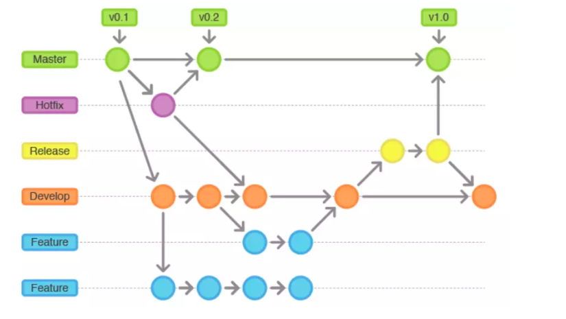
<i> GitFlow </i>

</div>

## Branches

### Master

-  Is the branch that exists throughout the life of the software created by default in Git when we create the repository
-  Contain the application's initialization code and versions that are ready to release for users to use (put tags on each version).
-  Usually configurable for interactive management.

<div align="center">

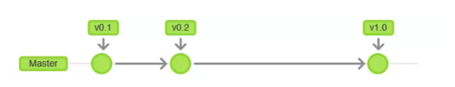
<i> Master branch </i>

</div>

### Develop

-  Is where ongoing development work takes place. It serves as an integration branch for `features` and `bug fixes`.
-  New features and bug fixes (on branch `feature` and `bugfix`) are merged into develop.

> When the **dev team** _completes_ all the features of a topic, the **teamlead** _reviews_ the application and _merges_ it to the `release` branches to create a product release.

<div align="center">

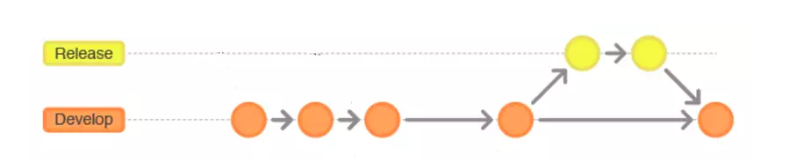
<i>Develop branch </i>

</div>

### Feature

-  Are branches forked from `develop` to work on new features or significant changes.
-  They are prefixed with **"feature/"**.
-  Once a feature is complete, the branch is merged back into `develop`.

> **The dev** makes a _merge request_ to the `develop` branches for **teamlead** _review_ and _merges_ it back into the `develop` branches.

<div align="center">

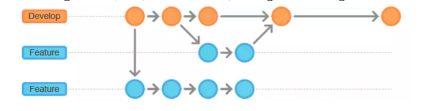
<i>Feature branch </i>

</div>

### Release

-  Is a forked branch from `develop` to prepare a new release
-  They allow for finalizing the release, performing last-minute bug fixes, and preparing for deployment.
-  Once ready, the `release` branch is merged into both `develop` and `master`, then deleted.

> when release the app, **teamlead** will _merge_ to `release` branches to prepare the build release for users.

<div align="center">

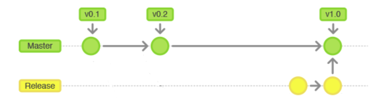
<i>Release branch </i>

</div>

### Hotfix

-  Are branches forked from `master` to fix critical bugs in production code.
-  They allow for quick fixes without disturbing ongoing development. Once the hotfix is complete, it's merged into both `develop` and `master`.

> When you need to change the configuration for a hotfix learning release in production, **teamlead** will create a branch base on the `master` branch for _hotfixing_ and then _merge_ it back into the `master` (usually, it will not be possible to change the source code directly on the `master` branch, so you have to change the source code on the `master` branch).

<div align="center">

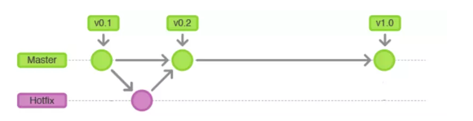
<i>Hotfix branch </i>

</div>

## Benefits

-  Clear separation of stable and development code
-  Structured approach to feature development
-  Enables parallel development and collaboration
-  Facilitates bug fixing and release preparation
-  Provides a version control history that reflects project milestones

## Note

### Using Merge Request

-  Create a `merge request` so that the **teamlead** or **reviewer** can _review the source code_ before _merging_ to ensure the integrity of the source code, which is extremely important when developing software with a large team.
-  **The reviewer** will _comment_ directly on the need for changes to the merge request to reduce the exchange time and increase efficiency when working in groups.
-  Create a `merge request` to save the change history of the source code. When there are problems with errors, software quality.... we can review all the above changes from the code line (the This can be checked by checking each commit but commits are many).
-  This is also a place to save reviewers' comments, common mistakes so that members don't make old mistakes again and a place to learn code from each other through reviewing code changes line by line. of another member.

### Reduce Conflicts Code

-  **Split code** into independent modules and limit writing too much code into one file,
-  **Regularly merge code** in branches to make sure the current code is the latest
-  **Merge branches' code** before and after code if there is a conflict, then merge conflict before creating the merge request.

## Develope Process

### Prequisites

Create branch `develop` from `master` branch.

```sh
# Create and Switch to `develop` branch
git checkout -b develop

# Push `develop` branch to remote
git push -u origin develop
```

### Feature Develop Process

> **Note:** `Issue tab` for creating a new task.

**Step 1:** **Teamlead** creates a task for developer.

<div align="center">

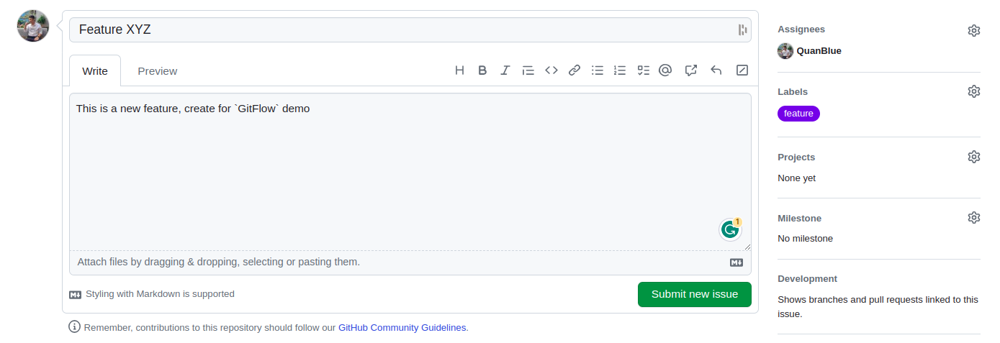
<i>Create new todo task</i>

</div>

**Step 2:** **Developer** has a task to do.

<div align="center">

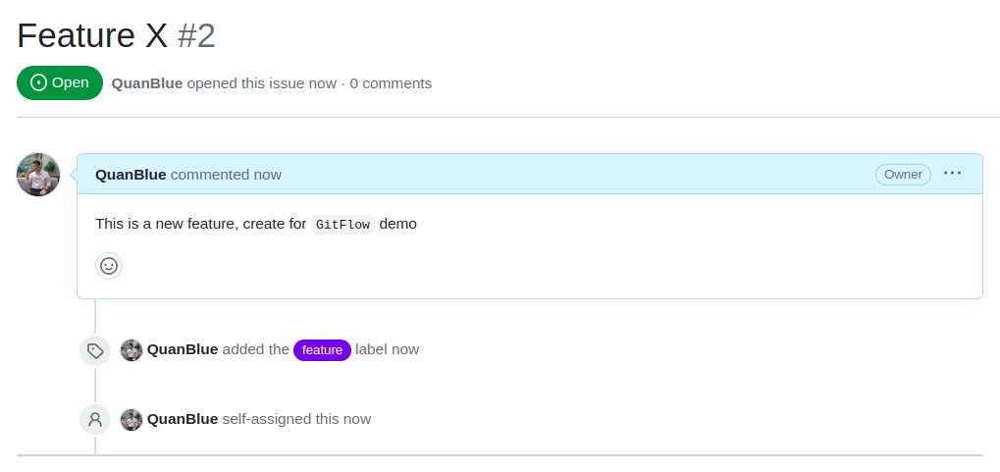
<i>Todo task - Issue ID: #8</i>

</div>

**Step 3:** **Developer** branches `develop`, let's call it `feature/8-xyz`.

```sh
# Create and Switch to `feature/8-xyz` branch
git checkout -b feature/8-xyz

# Push `feature/8-xyz` branch to remote
git push -u origin feature/8-xyz
```

> **Note:** Feature branch name syntax: `feature/[issueID]-[issueName]`

**Step 4:** Developer works on feature/x.

-  Here is example create a new file `feature-2-x.txt` and add content to it.

```sh
echo "feature-8-xyz" > feature-8-xyz.txt
```

-  Developer writes their own unit tests for `feature/8-xyz`.

**Step 5:** Developer publishes `feature/8-xyz`.

-  Developer gets updates from `develop` when needed (by merging `develop` in).

```sh
# commit
git add .
git commit -m "#8 - init feature/8-xyz"

# pull and merge from develop branch
git pull origin develop
```

-  Developer makes sure their unit tests and all regression tests pass locally.
-  Developer pushes `feature/8-xyz`

```sh
# commit
git add .
git commit -m "#8 - solve conflict"

# push
git push origin feature/8-xyz
```

> **Note:** commit message syntax: `#[issueID] - [commit message]`

-  Developer makes sure their unit tests and all regression tests pass on build server.

**Step 6:** Developer create pull request to `develop`.

<div align="center">

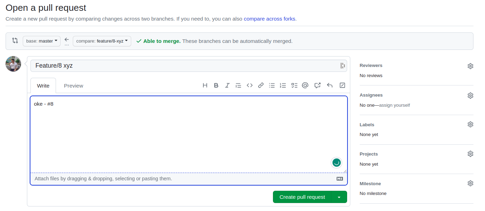
<i>Dev - create Pull Request</i>

</div>

<div align="center">

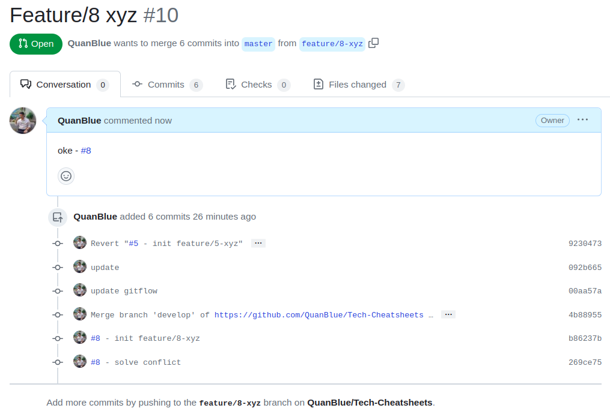
<i>Issue updated - after create Pull Request</i>

</div>

**Step 7:** Teamlead merges pull request into `develop` branch.

<div align="center">

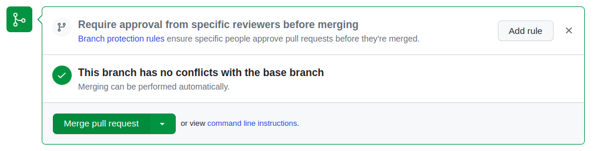
<i>Merge Pull Request</i>

</div>

<div align="center">

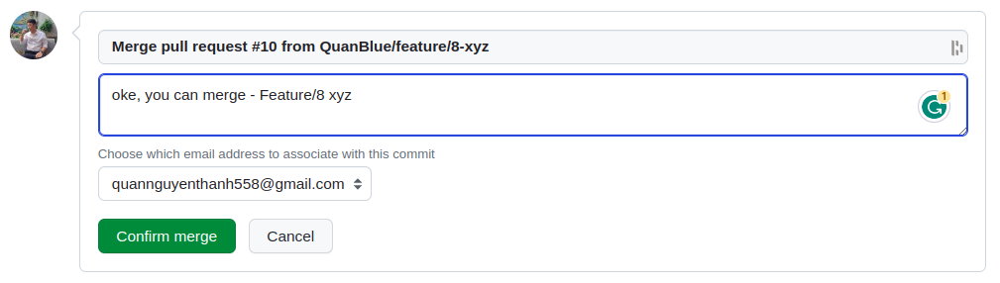
<i>Confirm merge</i>

</div>

<div align="center">

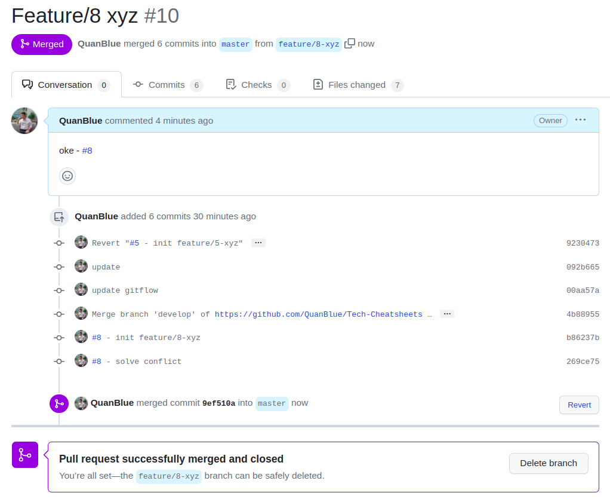
<i>Issue updated - after Merge</i>

</div>

-  Build server deletes remote `feature/8-xyz`.

```sh
# Switch to develop branch
git checkout develop

# Delete local feature/8-xyz
git branch -d feature/8-xyz

# Delete remote feature/8-xyz
git push origin --delete feature/8-xyz
```

**Step 8:** Goto step 1.

### Release Process

Checkout to `release` branch from `develop` branch.

```sh
# Create and Switch to `release-v1.0.0` branch
git checkout -b release-v1.0.0 develop

# Push `release-v1.0.0` branch to remote
git push -u origin release-v1.0.0
```

> **Note:** Release branch name syntax: `release-v[version]`

Create Release Tag

```sh
git tag -a v1.0.0 -m "Release v1.0.0"
```

> **Note:**
>
> -  Git Tag syntax: `git tag -a [tag name] -m "[tag message]"`
> -  Tag name syntax: `v[version]`

Push Tag

```sh
git push --tag
```

<div align="center">

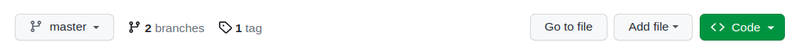
<i>Tag - recent push</i>

</div>

<div align="center">

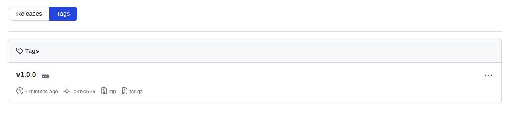
<i>Tag - detail</i>

</div>

Push `release` branch to `master` branch.

```sh
# commit
git add .
git commit -m "create release v1.0.0"

# push
git push
```
